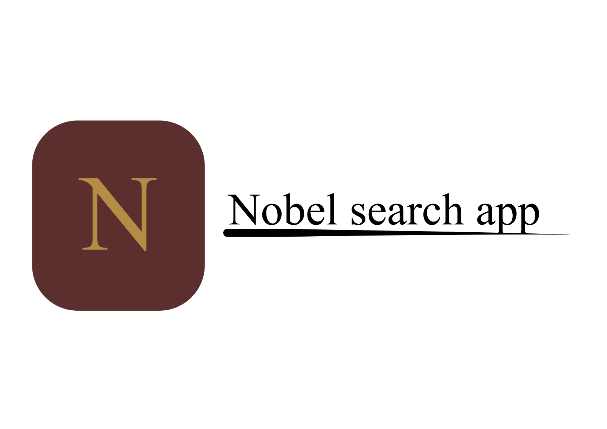
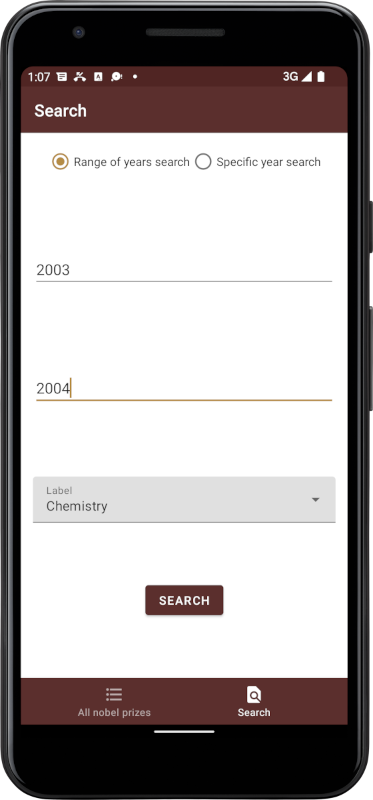
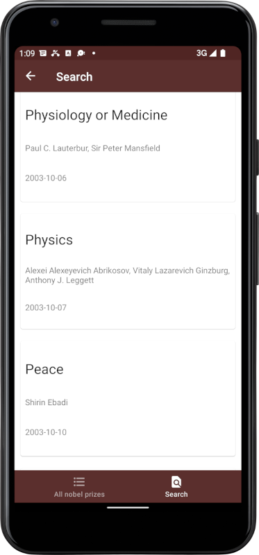

# Noble Search

Simple android app which is build with RxJava, Retrofit and Dagger 2.
It allows viewing and searching of all Nobel Prizes and winners.

## Screenshots

## Tech Stack

**Main language:** Java

**Multithreading:** RxJava

**Dependency Injection:** Dagger 2

**REST:** Retrofit

**Api:** [Nobel Prize Api](https://www.nobelprize.org/about/developer-zone-2/)

## 🚀 About Me
I'm highly curious and motivated individual interested especially the mobile technologies.
In my free time I really enjoy programming in the Java and Kotlin.

##  Contact

